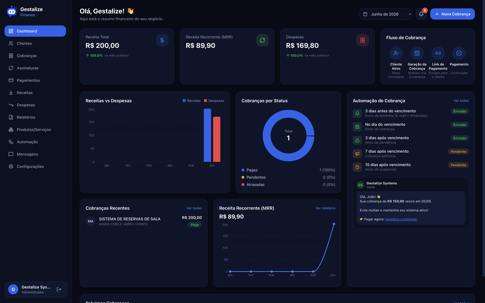
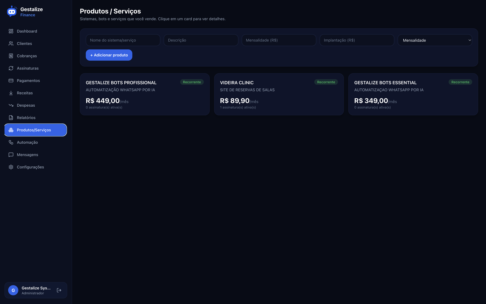
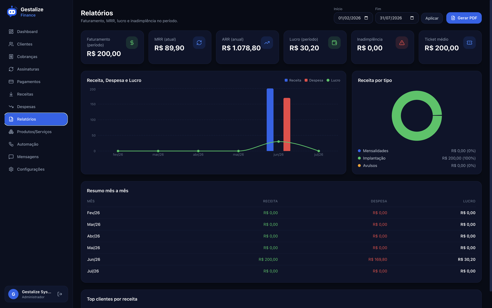
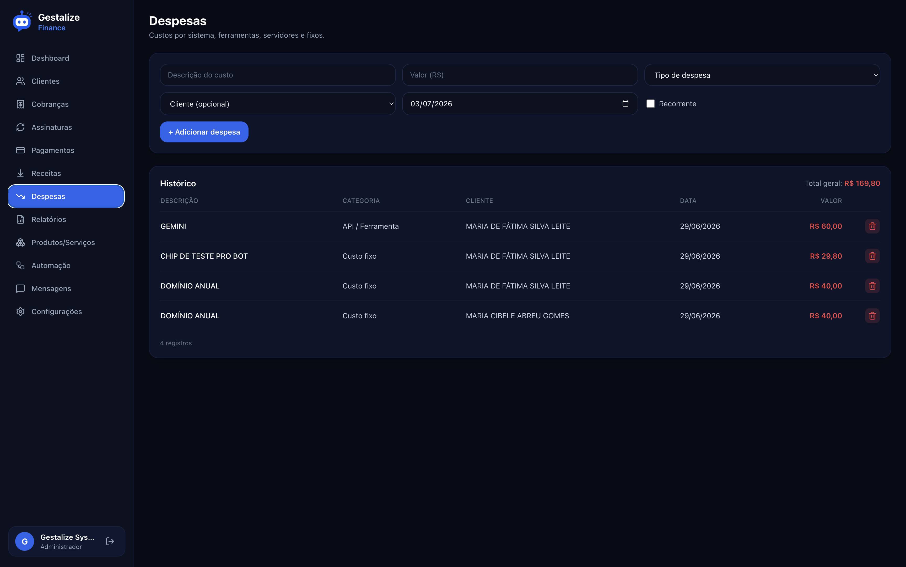

<p align="center">
  
</p>

<h1 align="center">Gestalize Finance</h1>

<p align="center">
  Financial Operations Platform for Modern Businesses
</p>

<p align="center">
  Manage customers, subscriptions, invoicing, recurring revenue and financial operations through a modern, centralized platform.
</p>

<p align="center">
  
  
  
  
</p>

<p align="center">
  Developed by <strong>Gestalize Systems</strong>
</p>

---

## Overview

Gestalize Finance is a modern financial operations platform designed to help businesses manage customers, subscriptions, recurring billing, revenue and financial performance from a single application.

The platform centralizes the entire billing lifecycle, automates recurring operations and provides real-time financial visibility through dashboards, reports and intelligent automation, reducing manual work while improving operational efficiency.

## Business Problem

Businesses that operate with recurring services often rely on disconnected spreadsheets, manual invoicing and fragmented financial tools.

As customer volume grows, billing, payment tracking and financial reporting become increasingly time-consuming, reducing operational efficiency and increasing the risk of errors.

Organizations need a centralized platform capable of automating financial operations while providing accurate, real-time visibility into business performance.

## Solution

Gestalize Finance centralizes customer management, subscriptions, billing, payments and financial reporting into a single platform.

Recurring invoices are generated automatically, payment status is continuously synchronized and financial indicators remain up to date, allowing organizations to focus on growth instead of repetitive administrative tasks.

## Key Features

- Financial dashboard with revenue, recurring revenue, average ticket, and
  delinquency indicators.
- Client management with per-client financial results.
- Product and service catalog with subscription and implementation pricing.
- Recurring subscriptions on monthly and annual cycles.
- Invoice generation, including combined implementation and subscription charges
  settled in a single payment.
- Automated dunning with pre-due and overdue notifications.
- Automatic payment reconciliation.
- Reporting by period with PDF export.
- Editable message templates for customer communication.
- Private access with optional two-factor authentication.
- Responsive interface for desktop, tablet, and mobile.

## Architecture Overview

Gestalize Finance is built around a modular architecture that separates financial operations, business rules, reporting and integrations into independent components.

The platform automates recurring billing, payment processing and financial reporting while integrating seamlessly with external payment, email and messaging services. This modular design ensures scalability, maintainability and flexibility as business requirements evolve.

## Technology Stack

- Next.js 14 (App Router, Server Components, Server Actions) with TypeScript
- Tailwind CSS
- PostgreSQL with Prisma ORM
- Recharts for data visualization
- REST integrations for payment, email, and messaging providers

## Project Structure

```
src/
  app/          Application routes and server actions
  components/    User interface components
  lib/           Business logic and integrations
prisma/          Data model and migrations
```

## Screenshots

<p align="center">
  
  <br />
  <sub>Financial dashboard with revenue, recurring revenue, and billing automation.</sub>
</p>

<table>
  <tr>
    <td width="50%" align="center" valign="top">
      
      <br />
      <sub>Product and service catalog.</sub>
    </td>
    <td width="50%" align="center" valign="top">
      
      <br />
      <sub>Financial reports by period.</sub>
    </td>
  </tr>
</table>

<p align="center">
  
  <br />
  <sub>Expense tracking by category.</sub>
</p>

## Future Improvements

- Multi-user access with role-based permissions.
- Additional payment methods and installment options.
- Advanced reporting and data export.
- Audit logging for financial operations.

## License

Gestalize Finance is proprietary software developed and maintained by Gestalize
Systems. All rights reserved.
