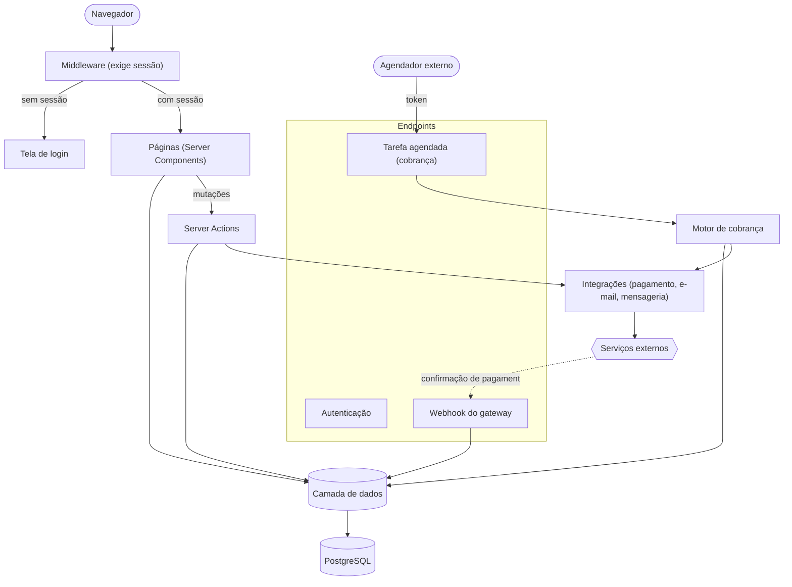
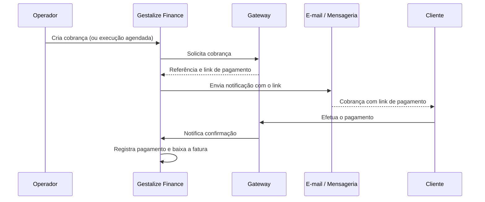
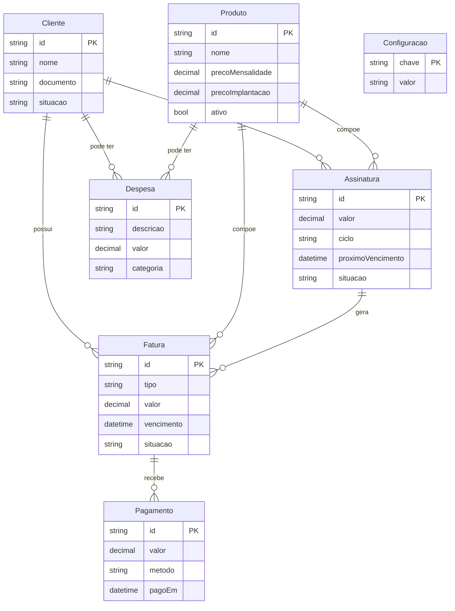

# Arquitetura

## Visão geral

O Gestalize Finance é uma aplicação única em Next.js (App Router). Não há um
backend separado: as telas são Server Components que leem os dados diretamente
pela camada de acesso a dados, e as operações de escrita usam Server Actions.
Apenas alguns endpoints existem para atender integrações externas e uma tarefa
agendada.



## Estrutura de pastas

```
src/
  app/
    layout.tsx        Layout raiz e metadados
    page.tsx          Painel principal
    actions.ts        Server Actions (criação, edição, baixa, cobrança)
    (rotas)/          Clientes, produtos, assinaturas, cobranças,
                      pagamentos, receitas, despesas, relatórios,
                      automação, mensagens, configurações, login
    api/              Endpoints de autenticação, webhook e tarefa agendada
  components/         Componentes de interface
  lib/                Regras de negócio e integrações
  middleware.ts       Proteção de rotas (exige sessão)
prisma/
  schema.prisma       Modelo de dados
  migrations/         Histórico de migrações
  seed.ts             Dados de exemplo
```

## Fluxo da aplicação

1. O usuário acessa uma rota. O middleware exige uma sessão válida; sem ela,
   redireciona para a tela de login.
2. A página (Server Component) lê os dados e é renderizada no servidor.
3. Ações do usuário (criar cobrança, dar baixa, salvar configurações) chamam
   Server Actions, que persistem os dados e disparam as integrações.
4. Eventos externos (confirmação de pagamento, execução agendada) chegam pelos
   endpoints da aplicação.

## Fluxo de autenticação

A autenticação foi implementada com primitivas nativas de criptografia, sem
bibliotecas de terceiros:

1. O acesso é validado contra credenciais administrativas.
2. Quando o segundo fator está habilitado, é exigido um código temporário (TOTP).
3. Uma sessão assinada é emitida e guardada em cookie protegido (`httpOnly`).
4. O middleware valida a sessão a cada requisição de página.
5. O encerramento de sessão remove o cookie e retorna à tela de login.

## Fluxo das integrações

Cada integração é isolada em seu próprio módulo e degrada com elegância: se não
estiver configurada, é ignorada sem interromper o fluxo.

- Ao gerar uma cobrança, a aplicação solicita a criação da cobrança ao gateway
  de pagamento e armazena a referência e o link de pagamento na fatura.
- Em seguida, monta as mensagens a partir de modelos editáveis e as envia pelos
  canais de e-mail e mensageria.
- Quando o pagamento é confirmado, o gateway notifica a aplicação, que registra o
  recebimento e baixa a fatura automaticamente.



## Banco de dados

Modelo relacional em PostgreSQL, com sete tabelas e enums de apoio.

| Tabela | Função | Relacionamentos |
|---|---|---|
| Cliente | Dados cadastrais e situação | 1—N Assinatura, Fatura, Despesa |
| Produto | Produtos e serviços (mensalidade e implantação) | 1—N Assinatura, Fatura, Despesa |
| Assinatura | Plano recorrente (valor, ciclo, próximo vencimento) | N—1 Cliente/Produto; 1—N Fatura |
| Fatura | Cobrança (tipo, valor, vencimento, situação, link) | N—1 Cliente/Produto/Assinatura; 1—N Pagamento |
| Pagamento | Recebimento de uma fatura (valor, método, data) | N—1 Fatura |
| Despesa | Custo (categoria, valor, data) | N—1 Cliente/Produto (opcional) |
| Configuração | Parâmetros e modelos de mensagem (chave-valor) | — |



### Regras de integridade

- A exclusão de um cliente remove em cascata suas faturas e os pagamentos
  associados.
- Despesas mantêm o histórico mesmo quando o cliente ou produto vinculado é
  removido.
- A baixa por confirmação de pagamento é idempotente e não duplica registros.

### Migrações

O histórico de migrações fica em `prisma/migrations/` e é aplicado
automaticamente durante o deploy. Em desenvolvimento, novas migrações são
geradas a partir de alterações no modelo de dados.

## Organização dos endpoints

A aplicação expõe um número reduzido de endpoints, dedicados a autenticação, ao
recebimento da confirmação de pagamento (webhook) e à execução da tarefa
agendada de cobrança. Os endpoints sensíveis são protegidos por token. As demais
telas não utilizam uma API REST: leem os dados no servidor e realizam as
operações de escrita por Server Actions.
